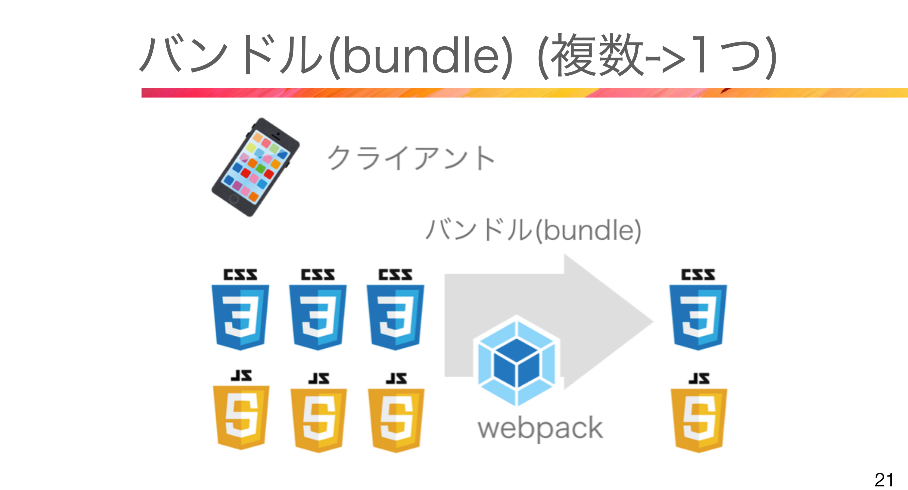

# 85. エロクラントとコレクション型

### DBからデータを取得する
DBから情報を取得する方法は大きく2つ
```php
1. Eloquent 
use App\Models\Test;
$tests = Test::all(); // モデル名::メソッド
dd($tests); // コレクション型(配列を拡張した型)

2. クエリビルダ
DB::table('tests')->get(); // DBファサード
```
### データ型のあれこれ
```php
allやgetを使うことでコレクション型になる
(getをつけないとQueryBuilder途中(確定してない))
$values = Test::all(); // Eloquent/Collection
$count = Test::count(); // 数字
$first = Test::findOrFail(1); // インスタンス
$whereBBB = Test::where('text', '=', 'bbb'); // Eloquent/Builder
$whereBBB = Test::where('text', '=', 'bbb')->get(); // Collection
dd($values, $count, $first, $whereBBB);
```

# 86. クエリビルダ

Select, where, groubpy orderByなどSQLに近い構文  
rawで生のSQLも書ける(その場合はSQLインジェクションに注意)  
getやfirstで確定、確定しなければQueryBuilder型

```php
use Illuminate\Support\Facades\DB;

DB::table('tests')->where('text', '=', 'bbb')->select('id', 'text')->get(); // コレクション型
DB::table('tests')->where('text', '=', 'bbb')->select('id', 'text'); // QueryBuilder
```


# 87. ファサード

フランス語で正面入り口  
よく使うファサード Auth(認証),DB(クエリビルダ),Hash(暗号化),Gate(認可),
Log(ログ),Mail(メール),Route(ルーティング),Storage(ストレージ)

ファサードの設定は config/app.phpのalias


# 88. 起動処理DIとサービスコンテナ


# 90. フロントエンド


フロントエンドで新しい言語で書いてもGoogleClomeなどではそのまま表示できないので、コンパイルして新しい書き方から古い書き方に変換する。


ファイルが増えればその分読み込みに時間がかかってしまうので、
バンドルして1つのファイルにまとめる
最近ではViteが主流。

これらvite,webpack,Loader,BABELなどをまとめて管理するのがNode.js(npm)でフロントエンドをまとめて動かす環境。
package.jsonがフロントエンドの管理ファイル


# 91. 認証(Vite と Laravel Breeze)

Laravel Breezeでログイン、ユーザー登録、パスワードリセット、メール認証、
パスワード確認機能を追加

 インストール
composer require laravel/breeze:^1.13 --dev

php artisan breeze:install
composer.json 追記  tailwindcss,alpinejs
App\Models\User.php 追記  Authenticatableクラスを継承して認証機能追加
resources\css\app.css 追記 tailwind読み込む  
下記が追加される  
App/View/Components  
resources/views/auth
resources/views/components
resources/views/layouts
resources/views/dashboard.blade.php

php artisan migrate
npm install
npm run dev // 開発サーバー起動(フロント側)
※php artisan serveはサーバー側

npm run build // 本番用にファイル出力
build/assetsフォルダのファイルで古い言語に置き換える


# 92. 追加されたルーティング情報を確認してみる

routes/web.phpの内容が書き変わって、
require __DIR__.'/auth.php'; を読み込んで、
routes/auth.phpにルーティングが記載されて、コントローラーを読み込んで、
App/Controllers/Authフォルダに8つのファイルが生成される


# 93. エラーメッセージの日本語化

1. マニュアルの言語ファイルをlang/ja/配下にそれぞれ配置する
   lang/ja/auth.php, pagination.php, password.php, validation.php
2. validation.php の 'attributes' に追記
   'attributes' => ['password' => 'パスワード]
3. ja.jsonファイルを作成
   lang/ja.json
   {
    "Whoops! Something went wrong.":"何か問題が発生しました。"
   }
